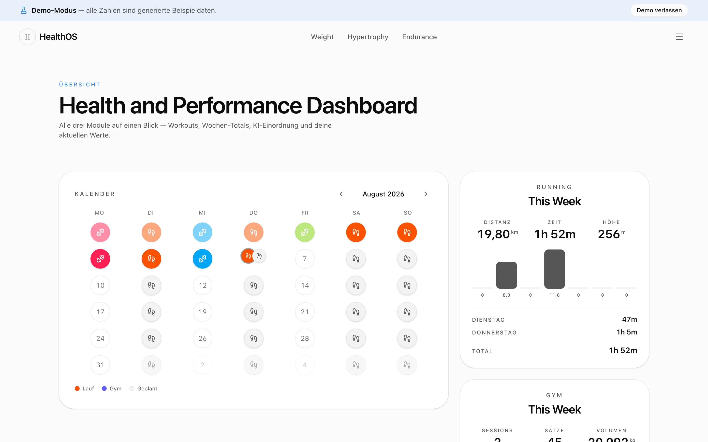
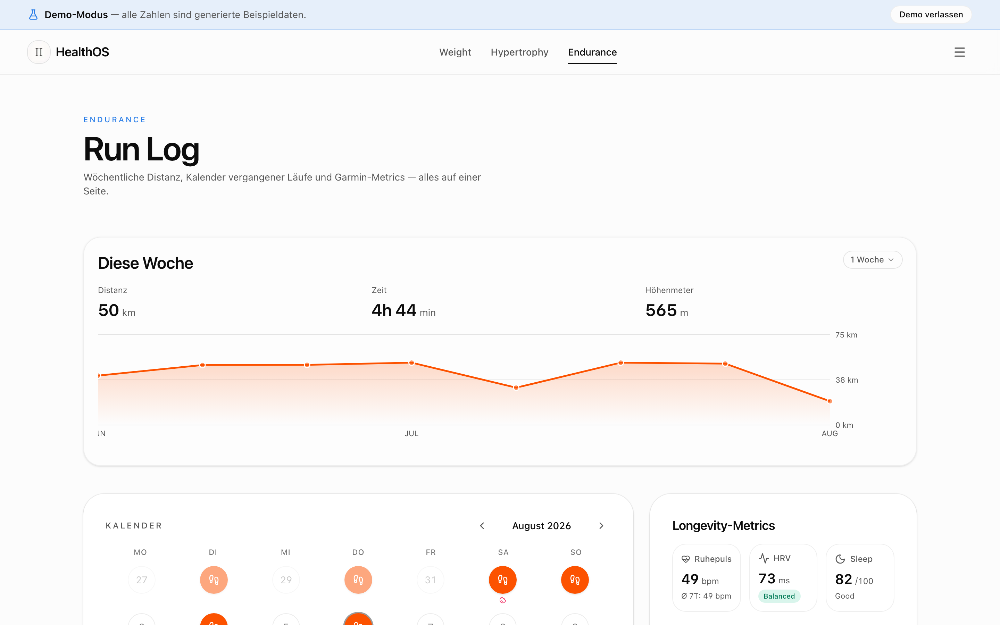
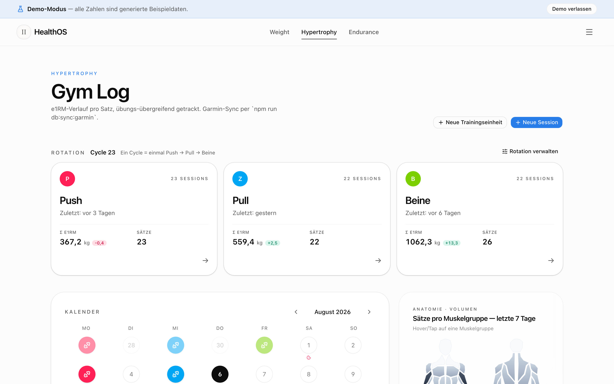
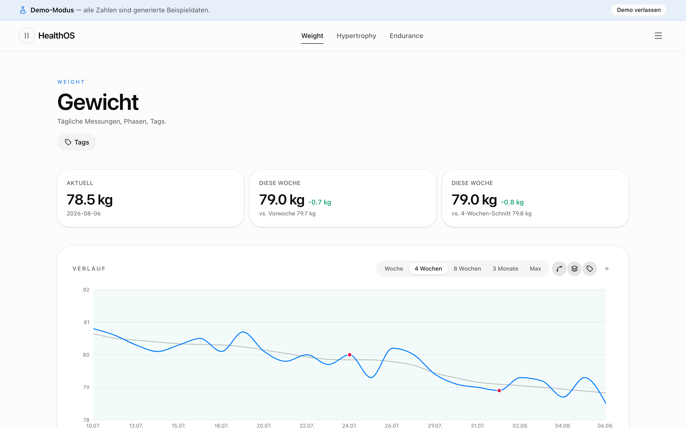
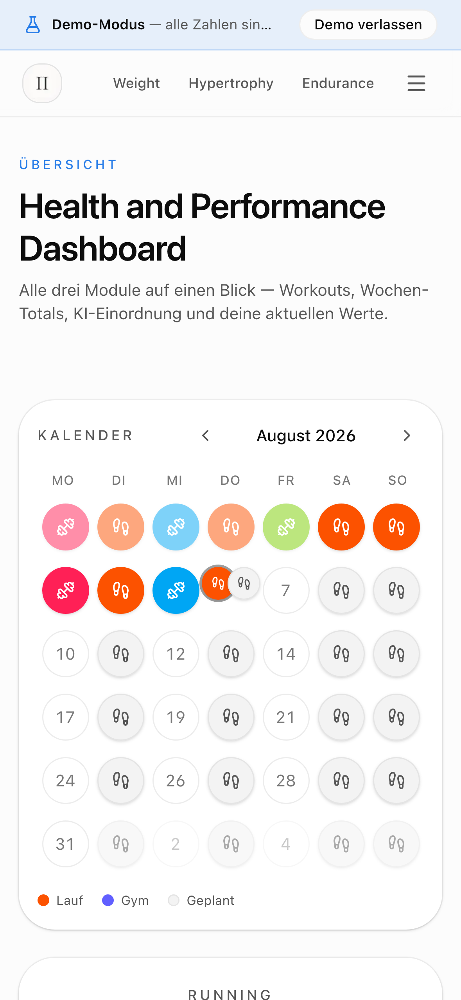
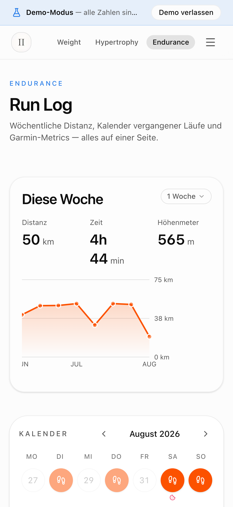
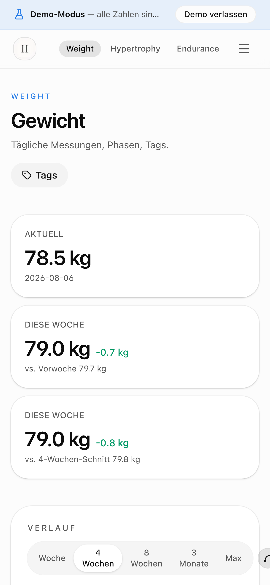
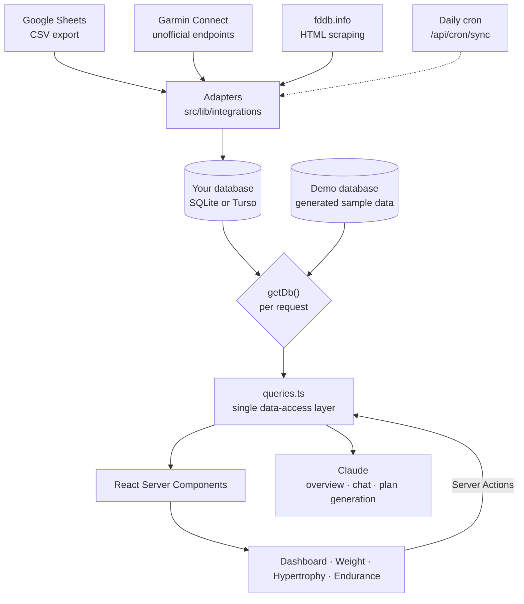

# HealthOS

Self-hosted training and body-weight dashboard that correlates data across running, lifting and nutrition.

[](https://github.com/kiliankanofsky/HealthOS/actions/workflows/ci.yml)
[](LICENSE)
[](https://nextjs.org)



<details>
<summary>More screenshots — endurance, hypertrophy, weight, mobile</summary>





<p>
  
  
  
</p>

</details>

> Every screenshot in this repository is taken from the built-in demo mode and
> shows generated sample data, never real measurements.

## Why

My body weight lived in a Google Sheet, my runs and sleep in Garmin Connect, my
lifting in a notes app, and my food log on a German nutrition site. Each of
them answered questions about itself and nothing else. None of them could tell
me whether a stalled cut was actually a stalled cut or three days of glycogen,
or whether the easy runs I logged were actually easy.

HealthOS is the answer to that: one database, one timeline, and analysis that
crosses the boundaries between the silos. It is built for a single person — me
— and every architectural decision follows from that.

## Features

- **Weight** — daily measurements with LOESS-smoothed trend, cut/bulk/maintenance
  phases, and day tags (cheat day, cheat meal, alcohol) that feed back into the
  calorie analysis.
- **Nutrition** — daily intake and macros, correlated against the weight trend.
  Calorie recommendations are derived per phase from the observed rate of change
  against the target rate, using the 7,700 kcal-per-kilogram rule. Cheat days
  override the tracked intake instead of quietly polluting the average.
- **Maintenance TDEE** — estimated from actual energy balance (mean intake minus
  weight-change rate × 7,700) over 7/14/28-day windows, cross-checked against
  Garmin's expenditure and consolidated by median.
- **Hypertrophy** — session logger over three rotating templates, per-exercise
  e1RM progression charts, an anatomical body map that colours muscle groups by
  weighted set volume, and Garmin strength-activity import.
- **Endurance** — run volume, calendar, and per-run detail (pace, heart rate,
  elevation, training effect). Daily Garmin snapshot: resting heart rate, HRV
  with its baseline corridor, sleep stages, VO₂ max, lactate threshold, race
  predictions.
- **Training zones** — a hybrid five-zone model built on an LT1/LT2 frame rather
  than a percentage of max heart rate. Z1–Z2 are heart-rate governed, Z3–Z5 are
  pace governed, and the paces come from your own runs: a weighted percentile of
  observed splits, a heart-rate-to-pace regression, or the Garmin marathon
  prediction, depending on which evidence the zone actually has.
- **Training plans** — a 16-week race plan with drag-and-drop sessions,
  structured interval blocks, and generation by Claude against a reference plan
  you upload as PDF or image.
- **Daily overview and chat** — a short model-written assessment per module, plus
  a read-only chat over the full cross-module context.

## Quickstart

Requires Node 20.9+.

```bash
git clone https://github.com/kiliankanofsky/HealthOS.git
cd HealthOS
npm install
npm run setup
npm run dev
```

Open <http://localhost:3000> and click **"Demo mit Beispieldaten starten"**.
You get the complete app running on generated sample data — no accounts, no API
keys, no Google Sheet.

`npm run setup` creates `.env.local` with a generated auth secret, applies the
migrations, seeds exercise and template master data, and builds the demo
database.

To use it for real, register the single allowed account on the same page and
add credentials for the integrations you want in `.env.local`.

> The interface is in German. That is not an oversight — it is a tool I use
> daily, and it was never translated.

## Architecture



Five things worth knowing:

1. **Adapters normalise, the database decides.** Every external source writes
   into the same schema; the UI never talks to an API. Sources are idempotent
   and re-runnable.
2. **One data-access layer.** Everything goes through `src/lib/db/queries.ts`.
   Pages and components never build queries.
3. **The demo mode swaps the connection, not the data.** `getDb()` returns a
   different database entirely when the demo cookie is present. Real data is
   unreachable rather than filtered.
4. **Server Components by default.** Client components exist only for charts,
   forms and drag-and-drop.
5. **Serverless-shaped.** No persistent filesystem, no background workers, no
   in-memory state between requests — it deploys to Vercel unchanged.

`CONTEXT.md` is the detailed reference: file index, function inventory, data
model, and known quirks. It is written in German.

## Data sources

All three are optional; each is a separate adapter you can ignore or replace.

| Source | Method | Caveat |
| --- | --- | --- |
| Google Sheets | CSV export URL, one row per ISO week | Sheet must be link-shared. The year is derived from calendar-week resets, so `SHEETS_START_YEAR` anchors the first row |
| Garmin Connect | `@gooin/garmin-connect` plus several undocumented endpoints | **Unofficial.** Garmin can change or block these at any time. Accounts with MFA enabled do not work |
| fddb.info | HTML scraping with a session cookie | **Fragile by nature.** The cookie expires regularly and the markup can change without notice |

Neither Garmin nor fddb.info offers a public API for this data. Use your own
account, respect the terms of service of both, and do not point this at anyone
else's data.

## Roadmap

Honest state of things:

- **Plan generation times out on Vercel.** Generating 16 weeks takes three to
  four minutes across four model calls; the platform limit is 60 seconds per
  action. It works locally. Production needs client-orchestrated chunking.
- **Turso migrations are manual.** Schema changes require running
  `USE_TURSO=1 npm run db:migrate` by hand before deploying.
- **Eight known lint errors** in chart and dialog components — React Compiler and
  `setState`-in-effect findings. CI reports them without failing.
- **Training zones need validation** against a proper lactate test rather than
  Garmin's threshold estimate.
- **No tests.** The analysis code in `src/lib/endurance/zone-estimation.ts` and
  `src/lib/utils/nutrition-recommendation.ts` is pure and deserves a suite.
- **Single user by design.** Multi-user support would require row-level
  ownership on every health table.

## Disclaimer

This is not medical advice, and it is not a medical device. It is a personal
project that computes numbers from data you give it. Calorie targets, training
zones and plans generated here are estimates from consumer-grade sensors and
simplified physiological models — treat them accordingly, and talk to an actual
professional before making decisions that matter.

No warranty of any kind. See [LICENSE](LICENSE).

## Stack

Next.js 16 (App Router) · React 19 · TypeScript · Tailwind CSS v4 · shadcn/ui ·
Drizzle ORM · libSQL (SQLite / Turso) · Recharts · Better Auth · Anthropic SDK

## License

[MIT](LICENSE) © Kilian Kanofsky
